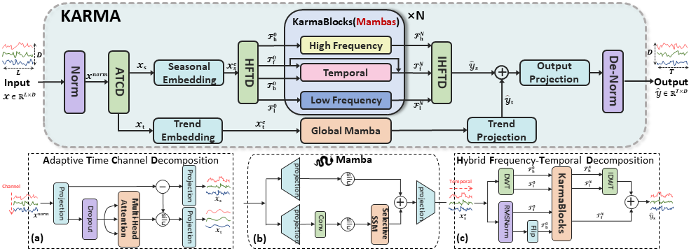
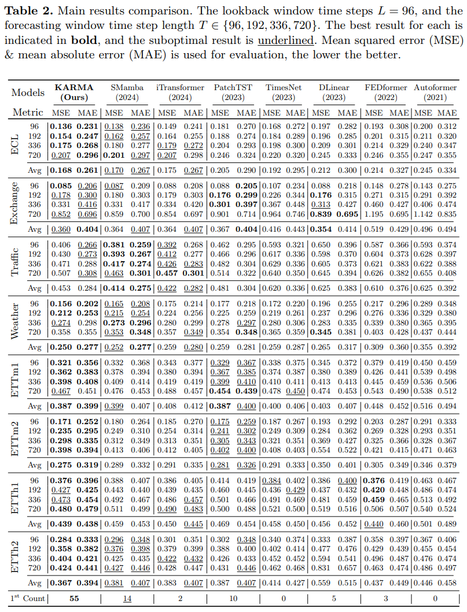

#  🐍 KARMA: A Multilevel Decomposition Hybrid Mamba Framework for Multivariate Long-Term Time Series Forecasting 🚩
<div align="center">

[](https)&nbsp;
&nbsp;
<!--&nbsp;-->

</div>

## 🌟 Contributions
* To the best of our knowledge, KARMA is the first framework to **integrate Mamba with multi-level decomposition for multi-scaled hybrid frequency-temporal analysis**, fully leveraging Mamba's potential to overcome the limitations of Transformer architectures and existing decomposition methods for efficient time series forecasting.
* We propose **ATCD for dynamic seasonal-trend decomposition and HFTD for hybrid frequency-temporal analysis**, enabling the effective utilization of latent information in time series data and improving predictive accuracy.
* Comprehensive experiments on eight real-world datasets across various domains demonstrate that KARMA achieves **state-of-the-art** performance in most benchmarks.


## 🧩 Architecture
<div align="center">
  
</div>


## 📑 Full Results
<div align="center">
  
</div>


## 📡 Prerequisites

Ensure you are using Python 3.10 and install the necessary dependencies by running:

```
pip install -r requirements.txt
```

## 📊 Prepare Datastes

Begin by downloading the required datasets. All datasets are conveniently available at [Autoformer](https://drive.google.com/drive/folders/1ZOYpTUa82_jCcxIdTmyr0LXQfvaM9vIy). Create a separate folder named `./dataset` and neatly organize all the csv files as shown below:
```
dataset
└── electricity.csv
└── Exchange.csv
└── traffic.csv
└── weather.csv
└── ETTh1.csv
└── ETTh2.csv
└── ETTm1.csv
└── ETTm2.csv 
```

## 💻 Run

```shell
sh ./scripts/Karma_all.sh
```

## 📚 Citation
If you find this repo useful, please consider citing our paper as follows:
```
@inproceedings{Ye2025KARMAAM,
  title={KARMA: A Multilevel Decomposition Hybrid Mamba Framework for Multivariate Long-Term Time Series Forecasting},
  author={Hang Ye and Gaoxiang Duan and Haoran Zeng and Yangxin Zhu and Lingxue Meng and Xiaoying Zheng and Yongxin Zhu},
  journal={arXiv preprint arXiv:2506.08939},
  year={2025}
}
```

## 🙏 Acknowledgement
Special thanks to the following repositories for their invaluable code and datasets:

- [https://github.com/thuml/Time-Series-Library](https://github.com/thuml/Time-Series-Library)
- [https://github.com/thuml/Autoformer](https://github.com/thuml/Autoformer)
- [https://github.com/wzhwzhwzh0921/S-D-Mamba](https://github.com/wzhwzhwzh0921/S-D-Mamba)
- [https://github.com/thuml/iTransformer](https://github.com/thuml/iTransformer)
- [https://github.com/Master-PLC/FreDF](https://github.com/Master-PLC/FreDF)
